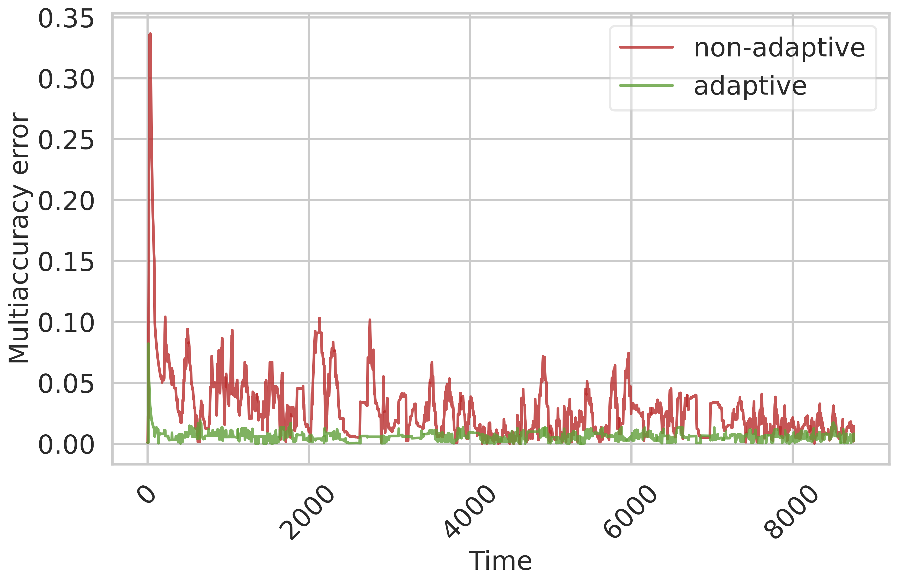

# Locally Adaptive Multi-Objective Learning

### Jivat Neet Kaur, Isaac Gibbs, and Michael I. Jordan

This repository includes code for reproducing our experiments and running [locally adaptive online multi-objective learning](https://arxiv.org/abs/2602.14952) algorithms.

<p align="center">
    <a style="text-decoration:none !important;" href="https://arxiv.org/abs/2602.14952" alt="arXiv">  </a>
    <a style="text-decoration:none !important;" href="https://docs.conda.io/en/latest/miniconda.html" alt="package management">  </a>
    <a style="text-decoration:none !important;" href="https://opensource.org/licenses/MIT" alt="License">  </a>

</p>

<p align="center">
    
</p>

## Setup

We provide an `environment.yaml` file with all dependecies. You can set up a Python 3.10 conda environment and install dependencies by running:
```
conda env create -f environment.yaml
conda activate adaptive-multiobjective
```

## Reproducing the experiments

`core/algorithms.py` contains the implementations for the core algorithms presented in the paper and additional variants. All classes are commented and structured for easy parsing and reference against the paper.

The datasets are organized into dedicated folders: `{compas, load, synthetic}`. To reproduce the experiments for a specific dataset, run the corresponding Jupyter notebook (e.g., `compas.ipynb`). All the experiments and ablations for each dataset are in the same notebook.

`compas/` reproduces the experiments on COMPAS dataset.

`load/` reproduces the experiments on the GEFCom2014 electric load forecasting dataset.

`synthetic/` reproduces the evaluation on simulated examples.


## Citation

```bibtex
@article{kaur2026adaptivemultiobjective,
  title={Locally Adaptive Multi-Objective Learning}, 
  author={Kaur, Jivat Neet and Gibbs, Isaac and Jordan, Michael I.}, 
  journal={arXiv preprint arXiv:2602.14952},
  year={2026}
}
```

